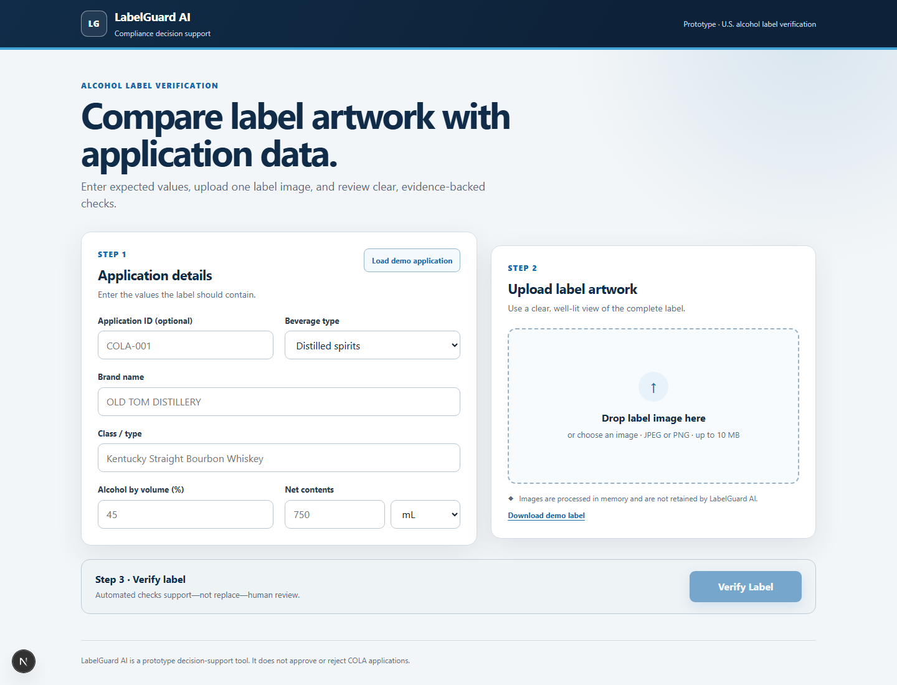
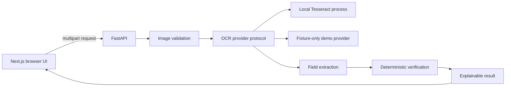

# LabelGuard AI

LabelGuard AI is a standalone decision-support prototype that compares U.S. alcohol label artwork with application data and explains every automated check.

## Live Demo

The application runs locally and in Docker without a paid service. A public host has intentionally not been selected; any future host must provide public HTTPS without billing information, a payment method, credits, or a paid subscription.

## Problem

Compliance agents repeatedly compare brand, class/type, alcohol content, net contents, and the mandatory Government Health Warning by eye. Slow or opaque automation would add work instead of reducing it.

## Solution

The application provides one obvious workflow: enter expected values, upload a JPEG or PNG, select **Verify Label**, and review Pass, Mismatch, Missing, or Needs Review results with detected evidence and confidence.

LabelGuard AI does not approve or reject a COLA application. It preserves human judgment for uncertain and image-dependent requirements.



## Features

- Single-label application form and drag-and-drop image upload
- MIME, encoding, size, and pixel-count validation
- Local Tesseract OCR behind a provider protocol
- Deterministic brand, class/type, ABV, proof, net-content, and warning rules
- Exact Government Health Warning heading, wording, and punctuation checks
- Confidence-aware results that never auto-pass low-confidence OCR
- Clickable image evidence, explanations, stage timings, structured logs, and safe errors
- EXIF orientation correction, resize safeguards, adaptive contrast, and bounded deskew
- One-click demo application loader
- Deterministic demo provider and downloadable test labels
- Responsive, keyboard-accessible UI with status words in addition to color
- Portable Docker packaging and GitHub Actions CI

## Architecture



The Next.js application is statically built and served by FastAPI in production, giving evaluators one endpoint. OCR runs inside the same machine or container, with no API key or paid cloud dependency. See [architecture](docs/architecture.md).

## Verification Logic

- Text is Unicode-, case-, whitespace-, punctuation-, and apostrophe-normalized before comparison.
- Exact normalized matches pass. Text similarity of 95% or higher passes, 85–94% needs review, and lower similarity mismatches.
- ABV is parsed from alcohol-by-volume statements; proof is converted with `proof / 2`, but proof-only or `ABV`-only formatting needs review.
- Net contents are converted to milliliters (`L`, `mL`, and `fl oz`) before numeric comparison.
- OCR confidence below 80% needs review and never automatically passes.
- A mismatch or missing required field makes the overall result Mismatch; otherwise any review makes it Needs Review.

## Government Warning Validation

The canonical statement is maintained once in the backend. Heading capitalization, required words, and punctuation are reported separately. Bold styling and physical type size are explicitly not evaluated because OCR output and an unscaled photograph cannot prove them reliably.

The implementation follows the [TTB Health Warning guidance](https://www.ttb.gov/regulated-commodities/beverage-alcohol/distilled-spirits/ds-labeling-home/ds-health-warning).

## Technology Choices

- Next.js 16, React 19, and TypeScript for a compact accessible interface
- FastAPI, Pydantic, Pillow, and pytesseract for typed request handling and local OCR
- Tesseract and pytesseract for local OCR with word confidence and geometry
- Pytest, Ruff, Vitest, Testing Library, ESLint, and TypeScript for quality gates
- One multi-stage container for portable deployment on any qualifying host

The OCR provider protocol keeps image reading separate from regulatory verification and allows future local engines without changing the rules.

## Local Setup

Prerequisites: Node.js 22+, npm 10+, Python 3.12+, and Tesseract 5 with English language data. Docker is optional and already includes Tesseract.

```powershell
python -m venv .venv
.\.venv\Scripts\python -m pip install -e '.\apps\api[dev]'
Set-Location apps\web
npm ci
```

On macOS/Linux, activate `.venv/bin/python` and use forward-slash paths.

Install Tesseract locally using the [official installation guidance](https://tesseract-ocr.github.io/tessdoc/Installation.html). On Windows, add the installation directory to `PATH` or set `TESSERACT_CMD` to the full executable path.

## Environment Variables

Copy `.env.example` to `.env` and set:

- `OCR_PROVIDER=tesseract` for normal operation or `demo` for bundled fixtures only
- `TESSERACT_CMD` only when the executable is not on `PATH`
- `OCR_TIMEOUT_SECONDS` (defaults to 8)
- `NEXT_PUBLIC_API_URL=http://localhost:8000` for split local development

No OCR credentials are needed. Do not commit local machine-specific configuration.

## Run Locally

Start the API:

```powershell
$env:OCR_PROVIDER='tesseract'
.\.venv\Scripts\uvicorn app.main:app --app-dir apps\api --reload --port 8000
```

Start the UI in a second terminal:

```powershell
Set-Location apps\web
$env:NEXT_PUBLIC_API_URL='http://localhost:8000'
npm run dev
```

Open `http://localhost:3000`. If Tesseract is not installed, use `OCR_PROVIDER=demo` with repository fixtures; demo OCR only reads their embedded text, and an arbitrary upload returns Needs Review instead of invented text.

## Run Tests

```powershell
.\.venv\Scripts\ruff check apps\api\app apps\api\tests scripts
.\.venv\Scripts\ruff format --check apps\api\app apps\api\tests scripts
.\.venv\Scripts\pytest apps\api

Set-Location apps\web
npm run lint
npm run typecheck
npm test
npm run build
```

## Docker

```bash
docker compose up --build
```

The image installs Tesseract and English language data. No host OCR installation, credentials, or paid service is required. The app is available at `http://localhost:8000`.

## Deployment

The project deliberately does not select a final host yet. Its single Linux container can run on any platform that meets all of these constraints:

- public HTTPS URL
- no billing information or payment method
- no prepaid credits
- no paid subscription
- enough CPU and memory for local Tesseract

See [portable deployment guidance](docs/deployment.md). No external resources are created by this repository.

## Performance

The response reports image-preparation, OCR, extraction, verification, and total timings. On this Windows development host, 20 fixture-mode requests measured a 136.2 ms wall median and 169.0 ms p95 (131.5 ms/164.0 ms API-reported). Run `.venv/Scripts/python scripts/benchmark_demo.py` to reproduce it. These numbers exclude live Tesseract and must not be presented as OCR performance. Real OCR must be measured after Tesseract is installed and again on the final host; the warm target remains approximately five seconds or less.

## Test Data

Download or upload the fixtures under [`tests/fixtures/labels`](tests/fixtures/labels):

- `demo-pass.png`
- `demo-brand-mismatch.png`
- `demo-abv-mismatch.png`
- `demo-warning-error.png`
- `demo-rotated.png`
- `demo-low-contrast.png`
- `demo-unreadable.png`

Regenerate them with `.venv/Scripts/python scripts/generate_demo_labels.py`.

For the fastest evaluation, select **Load demo application**, download the demo label from the upload panel, upload it, and select **Verify Label**.

## Assumptions

See [docs/assumptions.md](docs/assumptions.md).

## Known Limitations

See [docs/limitations.md](docs/limitations.md).

## Security and Privacy

Uploads are size- and format-validated, processed in memory, and not retained. The service does not log image bytes, complete OCR text, application values, or secrets. Production OCR calls occur server-side and use timeouts. No database is included.

## Future Improvements

- Evaluate additional free, local OCR engines behind the existing provider protocol
- Validate style and physical type size when reliable scale/font evidence is available
- Add beverage-specific and same-field-of-vision rules
- Add bounded-concurrency batch workflows only after the single-label system remains stable
