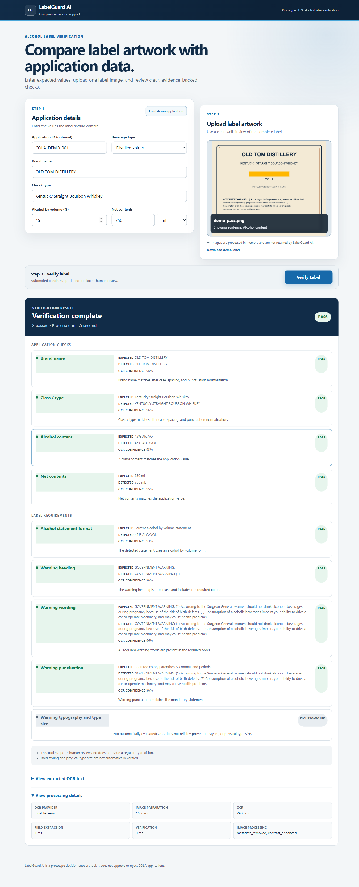
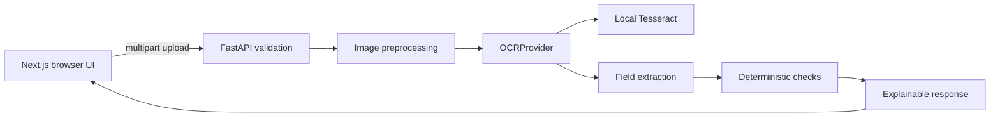

# LabelGuard AI

A standalone decision-support prototype that compares U.S. alcohol label artwork with application data and explains its automated checks. It does **not** approve or reject COLA applications.

## Live demo

**[Open LabelGuard AI](https://labelguard-ai-4g5s.onrender.com)** · [Source repository](https://github.com/evrimakgul/labelguard-ai) · [CI](https://github.com/evrimakgul/labelguard-ai/actions/workflows/ci.yml)

1. Select **Load demo application**.
2. Select **Download demo label**, then upload that PNG.
3. Select **Verify Label**.
4. Review expected/detected values, confidence, warning checks, and image evidence.

Render Free may sleep after 15 idle minutes; the first visit can take about a minute to wake. Once warm, the measured median was **4.86 seconds**, p95 **5.30 seconds**. This is near the assignment's “about five seconds,” not a strict five-second guarantee. No login or OCR API key is required.



## Verified status and scope

Public HTTPS, all seven real-OCR fixtures, safe API errors, desktop/mobile workflows, keyboard evidence selection, and recovery were verified on **2026-09-08**. The user confirmed Render **Free ($0/month)**, no billing/payment method/credits/subscription, and deployed source **919e241**. Auto-Deploy is unconfirmed; the public API does not expose a commit identifier or account settings.

P0 core and P1 image/evidence work are implemented. Source 919e241 and public-documentation checkpoint 5a792ed passed CI; [the latter run](https://github.com/evrimakgul/labelguard-ai/actions/runs/34188726208) includes backend, frontend production build and container/live OCR. Local verification previously passed 42 backend tests (35 deterministic + 7 opt-in native OCR) and 6 frontend tests. CI unit tests do not require Tesseract; the separate container job installs it and exercises real OCR. See [current status](docs/PROJECT_STATUS.md) and [submission review](docs/SUBMISSION_READINESS.md). The prototype is ready for submission with the stated limitations; no claim of production accreditation or strict five-second performance is made.

Implemented:

- Application form; JPEG/PNG upload, MIME/encoding validation, 10 MiB and 40-million-pixel limits.
- Brand, class/type, alcohol content, net contents, and Government Health Warning comparisons.
- Pass, Mismatch, Missing, and Needs Review checks with explanations and OCR confidence.
- EXIF orientation, metadata removal, resizing, adaptive contrast, and bounded deskew.
- Clickable/keyboard-selectable evidence, extracted text, timings, demo loader and fixtures.
- Local Tesseract behind `OCRProvider`; a clearly labeled fixture-only demo provider.
- Static Next.js frontend, FastAPI API, Docker packaging, tests, and CI.

Deferred, not implied by beverage-type selection: batch/CSV workflows, producer/importer/address and origin checks, expanded beverage-specific rules, COLAs integration, user accounts and case storage. Distilled spirits are the primary test profile. P2 is not needed to demonstrate the accepted core prototype.

## Approach and architecture

OCR reads the image; deterministic code makes comparisons. Human review handles uncertainty.



One multi-stage Docker image serves the statically exported UI and API on the same origin. Tesseract runs within that container; there is no database, LLM comparison service, paid OCR API, or runtime OCR network call. Demo mode is a test alternative, not the production OCR path. [Architecture details](docs/architecture.md)

## Verification rules and limits

- Brand/class comparisons normalize Unicode, case, whitespace, punctuation, and typographic apostrophes. Exact matches pass; similarity ≥95% also passes, 85–<95% needs review, and lower similarity mismatches. These are prototype heuristics, not proof of regulatory equivalence.
- OCR confidence below 80% requires review rather than an automatic pass.
- ABV values are compared within 0.05 percentage points; proof converts via `proof / 2`. Proof-only, bare-percent, or the literal `ABV` abbreviation requires statement-format review.
- Net contents convert L, mL and U.S. fl oz to milliliters, with a 1 mL comparison tolerance.
- Missing required fields or mismatches produce overall Mismatch; otherwise unresolved checks produce Needs Review. Insufficient readable text produces Needs Review.
- Warning heading capitalization/colon, case-insensitive required word sequence, and punctuation after case/whitespace normalization are checked separately against one canonical constant. No fuzzy matching is used for warning words.
- Bold heading, non-bold body, physical type size, statement separation and same-field-of-vision compliance are **not proven automatically**. “Pass” is not full regulatory compliance.
- Evidence polygons are approximate after geometric preprocessing because the preview displays the original upload.

The warning checks are informed by [TTB health-warning guidance](https://www.ttb.gov/regulated-commodities/beverage-alcohol/distilled-spirits/ds-labeling-home/ds-health-warning). See [assumptions](docs/assumptions.md) and [limitations](docs/limitations.md).

## Technology choices

Next.js 16 / React 19 / TypeScript provide the interface. FastAPI / Pydantic provide typed API validation; Pillow / OpenCV handle images; pytesseract adapts local Tesseract. Pytest, Ruff, Vitest, Testing Library, ESLint and TypeScript cover deterministic behavior and quality gates. Docker keeps production portable.

## Local setup

Tested toolchain: Python 3.12, Node.js 22, npm, Git, and Tesseract 5 with English data. Native Tesseract is needed only for live OCR, not deterministic tests. Docker/Podman includes its own OCR runtime and does not need host Python/Node/Tesseract.

From a new checkout, PowerShell:

```powershell
git clone https://github.com/evrimakgul/labelguard-ai.git
Set-Location labelguard-ai
python -m venv .venv
.\.venv\Scripts\python.exe -m pip install -e './apps/api[dev]'
npm.cmd --prefix apps/web ci
```

Install Tesseract using the [installation guide](https://tesseract-ocr.github.io/tessdoc/Installation.html). Verify `tesseract --version` and `tesseract --list-langs` includes `eng`. Add it to PATH or export `TESSERACT_CMD` with the executable's absolute path.

Run the API from the repository root:

```powershell
$env:OCR_PROVIDER='tesseract'
$env:OMP_THREAD_LIMIT='1'
.\.venv\Scripts\python.exe -m uvicorn app.main:app --app-dir apps/api --reload --port 8000
```

Run the UI in a second terminal, also from the repository root:

```powershell
$env:NEXT_PUBLIC_API_URL='http://localhost:8000'
npm.cmd --prefix apps/web run dev
```

Open `http://localhost:3000`. Without Tesseract, set `OCR_PROVIDER=demo` before starting the API and use only the bundled fixtures. Arbitrary images are not assigned invented demo text.

For macOS/Linux, use `python3 -m venv .venv`, `.venv/bin/python`, `npm` instead of `npm.cmd`, and `export NAME=value` instead of PowerShell environment assignments. For example:

```sh
.venv/bin/python -m pip install -e './apps/api[dev]'
npm --prefix apps/web ci
OCR_PROVIDER=tesseract OMP_THREAD_LIMIT=1 .venv/bin/python -m uvicorn app.main:app --app-dir apps/api --reload --port 8000
# In a second terminal, from the repository root:
NEXT_PUBLIC_API_URL=http://localhost:8000 npm --prefix apps/web run dev
```

### Environment

`.env.example` documents defaults; copying it does not automatically configure both processes. The API reads process environment variables, or use `--env-file .env` with the root-level uvicorn command. Next.js reads its own app-directory environment files; the explicit shell commands above avoid that ambiguity.

Normal OCR uses `OCR_PROVIDER=tesseract`, optional `TESSERACT_CMD`, and `OCR_TIMEOUT_SECONDS=8`. Docker defaults `OMP_THREAD_LIMIT=1`. Keep `NEXT_PUBLIC_API_URL` unset for the same-origin production build; do not point a public browser at localhost. No app secret or OCR credentials are required. Never commit private configuration.

## Tests and quality gates

Run from the repository root:

```powershell
.\.venv\Scripts\ruff.exe check apps/api/app apps/api/tests scripts
.\.venv\Scripts\ruff.exe format --check apps/api/app apps/api/tests scripts
.\.venv\Scripts\python.exe -m pytest apps/api/tests
npm.cmd --prefix apps/web run lint
npm.cmd --prefix apps/web run typecheck
npm.cmd --prefix apps/web test
npm.cmd --prefix apps/web run build
```

Optional native OCR acceptance requires `tesseract` on PATH:

```powershell
$env:RUN_LIVE_OCR='1'
$env:OMP_THREAD_LIMIT='1'
.\.venv\Scripts\python.exe -m pytest apps/api/tests/test_live_tesseract.py
Remove-Item Env:RUN_LIVE_OCR
```

The seven live cases cover pass, brand mismatch, ABV mismatch, warning error, rotation, low contrast and unreadable artwork. They are synthetic regression fixtures, not an accuracy estimate across real commercial labels. [Test cases](docs/test-cases.md)

## Docker / Podman

From the repository root, with an OCI engine running and port 8000 available:

```powershell
podman build --tag labelguard-ai:local .
podman run --rm --publish 8000:8000 labelguard-ai:local
```

Use `docker` instead of `podman` with Docker Engine. Open `http://localhost:8000` after readiness. On this Windows Podman/WSL setup, IPv4 loopback forwarding failed; direct VM-address access worked. See [deployment instructions](docs/deployment.md) for route discovery and safe existing-container handling. This local issue does not affect the public Render URL.

The image contains Tesseract/English data and serves both UI and API as a non-root user. OCI may ignore Dockerfile HEALTHCHECK metadata; configure an HTTP `/api/health` probe. Health proves liveness, not OCR availability.

## Public performance and hosting

Render Free hosts the prototype at the link above. The user confirmed no billing/payment method, prepaid credits, or paid subscription. No paid resources are needed by this application.

Measured 2026-09-08: seven correctness requests, then 20 sequential warm `demo-pass.png` requests over public HTTPS, without concurrent browser OCR. Nearest-rank p95:

| Measurement | Median | p95 |
| --- | ---: | ---: |
| Client wall time (includes network) | 4857.8 ms | 5304.0 ms |
| API total | 4731.0 ms | 5218 ms |
| OCR stage | 3163.5 ms | 3495 ms |

Reproduce from an environment with the backend development dependencies:

```powershell
.\.venv\Scripts\python.exe scripts/verify_container.py --base-url https://labelguard-ai-4g5s.onrender.com --requests 20
```

Visit the site first if asleep. The verifier checks all seven cases and safe 400/422 errors and reports timings; it does not enforce a strict latency threshold. Network, load, artwork and cold starts affect results. Cold-start time was **not measured** in this run. Render documents idle sleep after 15 minutes and roughly one-minute wakeup, limited monthly free allowances, and possible service suspension/restarts. [Render Free limitations](https://render.com/docs/free)

These are prototype trade-offs, not an always-on production SLA. No keep-alive workaround is configured. Prior native/container benchmarks and strict CPU-quota simulations are historical comparisons in [hosting research](docs/HOSTING_RESEARCH.md), not substitutes for these public measurements.

## Security, privacy and remaining scope

Images and application values are transient and are not retained by LabelGuard. OCR may use short-lived temporary files; there is no durable upload store. The app does not log full OCR text or uploaded images. Use synthetic/non-sensitive data for this public prototype. It has no accounts, production authorization, abuse-rate limiting or federal production accreditation.

Batch/CSV, broader beverage rules, regulatory typography/physical measurements, and difficult glare/curvature handling remain documented limitations or future work—not unfinished claims of P0 functionality. The Treasury source document remains unchanged.

[Submission readiness](docs/SUBMISSION_READINESS.md) · [Deployment runbook](docs/deployment.md) · [Project status](docs/PROJECT_STATUS.md)
